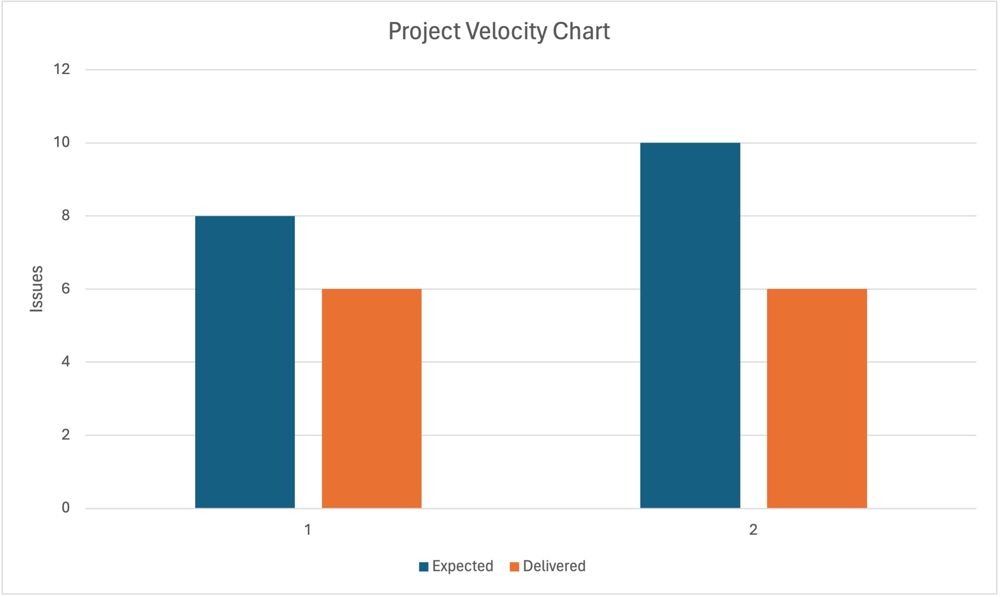

## Unsuccessful Part of the Project

One area of our project that has not been as successful as we would have liked since the start of it is our unit and integration testing. After learning about testing and understanding the importance of these tests we realized that testing is really important in ensuring the quality of our code and catching errors early. However, due to the nature of our project, which doesn't have many objects, we've found it challenging to write meaningful and detailed tests.

## Ways to Improve

To improve testing, we plan to:

1. **Refactoring our code:** We will refactor our code to make it more testable. This might involve breaking down complex classes/functions into smaller and more manageable ones so that they can be tested easily without affecting other parts of the code.

2. **Feature based testing:** While creating a feature each member will focus on writing tests for that specific feature only and not the other ones. Since the group member already has a clear idea of how their code works, this will help us write more targeted tests that are easier to maintain.

## Success Criteria

We will evaluate the success of the above improvements by:

1. **Ease of adding new features:** If our tests are good, we should be able to add new features quickly without refactoring much in our existing code. So, a decrease in the time it takes to add new features indirectly also indicates the success of our improvements.

2. **Number of errors caught by tests:** We will track the number of errors caught by our tests. An increase in this number will indicate that our tests are effective.

## Project velocity

Here is a graph showing our project velocity over the course of the two iterations.

